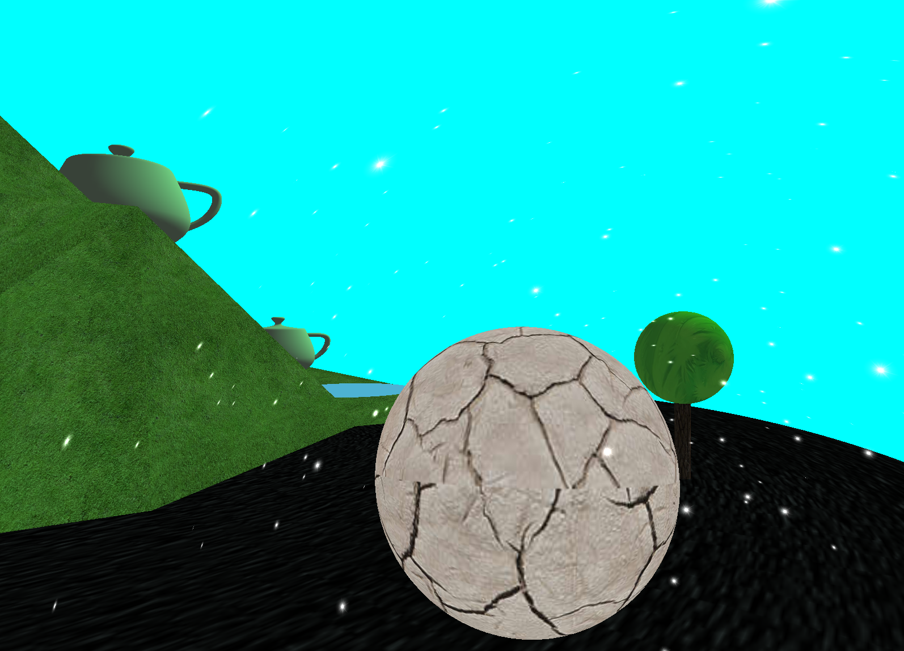

# 3D-game-Engine

## Description
A 3D game engine based on OPENGL.  
It will render the 3D world.  
With the different ".map" the program read, different 3D world will be rendered.  
 

## Construction
mapX.json - The input maps.

Game.java - this is the main entry point to your game

Terrain.java - this class represents variable height terrain

Tree.java - this class represents a tree

Road.java - this class represents a road as a bezier curve

LevelIO.java - this class reads and writes game levels to and from JSON files

## Techonology used
Related graphical technology: linear interpolating, Bezier Curve, textures, blended billboarded particles, VBOs, lighting algorithm, L-system...  

## Command
  * Up - Forward
  * down - Backward
  * left - Moving left
  * right - Moving right
  * r - Turn on or turn off the rainning mode
  * t - Turn on or turn off the avatar mode
  * n - Turn on or turn off the the night mode
  
## Running Instructions
 Run the project with Your map (like "mapX.json") as the parameter.

## Photo

